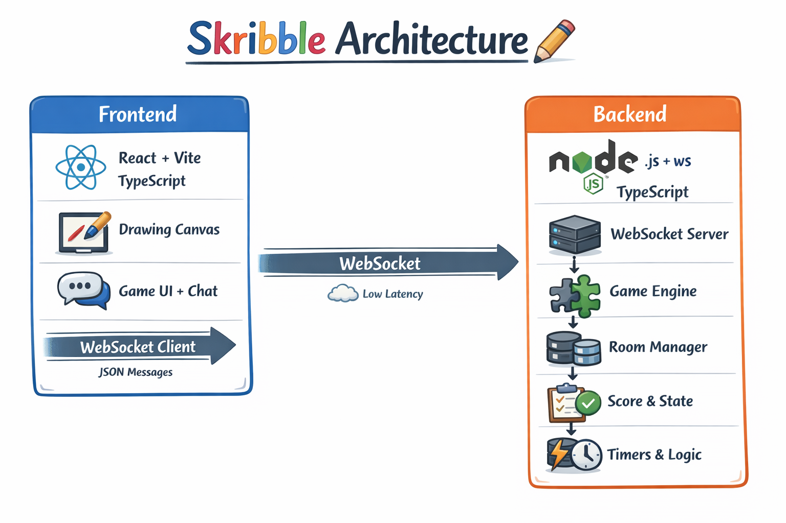
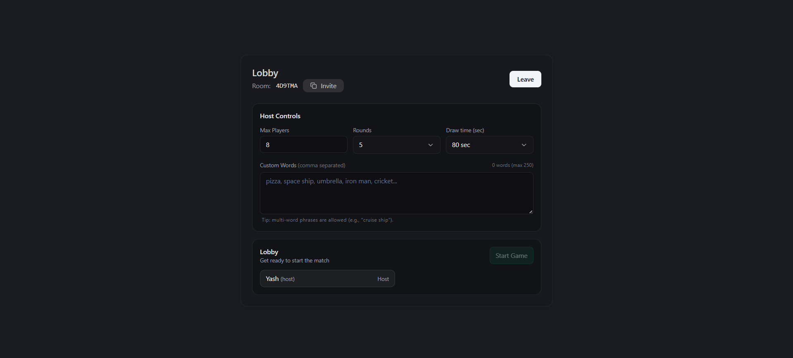
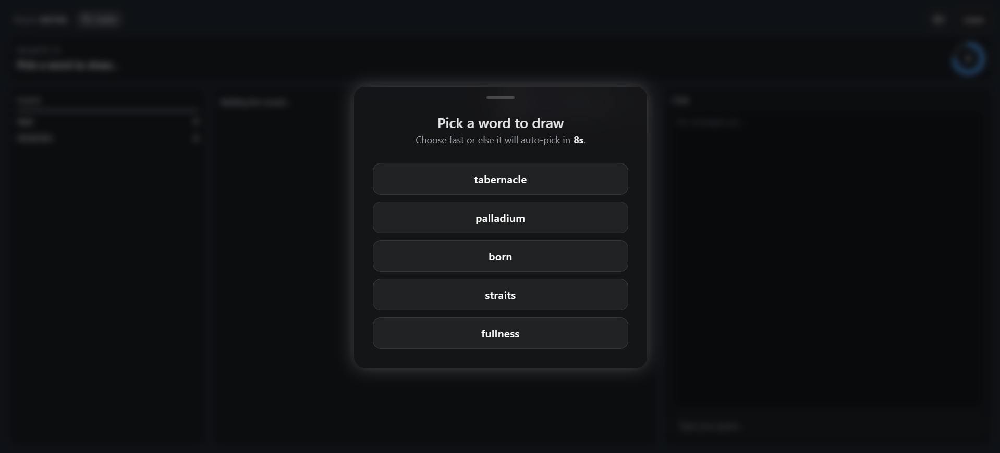
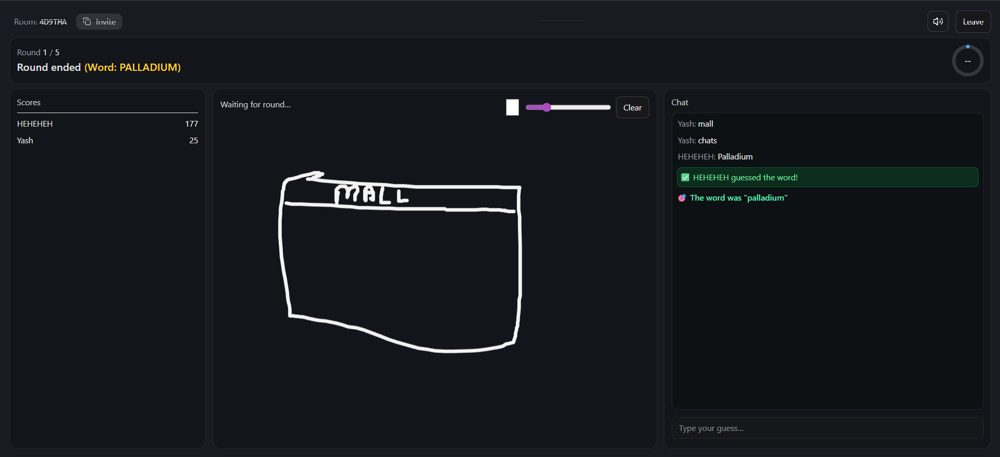
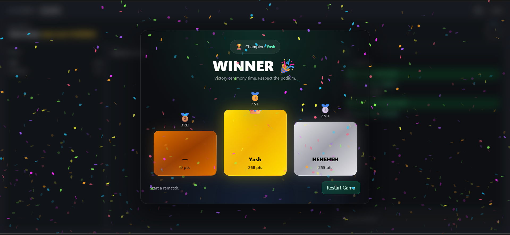

# Skribble 🎨⚡ — Realtime Multiplayer Drawing & Guessing Game

A realtime multiplayer drawing + guessing game (skribbl.io - style) built with **Node.js + Socket.io** and **React + Vite**, fully in **TypeScript**.

## 📸 Screenshots

Below are some UI snapshots from the Skribble realtime multiplayer game experience.

### Game Architecture



---

### Lobby — Create / Join Room



---

### Word Selection + Timer



---

### Canvas & Chat — Realtime Word Guessing



---

### Scoreboard — Round Results



---


## Tech Stack

**Frontend**
- React + Vite
- TypeScript
- Canvas (drawing board)
- WebSocket client

**Backend**
- Node.js
- WebSocket (ws)
- TypeScript

---

## Features

- Create / Join rooms via room code
- Realtime drawing sync (low latency)
- Chat + guessing in realtime
- Turn-based gameplay (drawer vs guessers)
- Word selection for drawer
- Scoring (correct guess + time-based bonus optional)
- Round timer
- Player list + host controls
- Late-join support (sync current round + canvas snapshot/replay)
- Fully typed WS messages (TypeScript end-to-end)

---

## Getting Started

## Backend Setup (Node + Websocket + TS)

```bash
cd backend
npm install
```

### Environment Variables

Create `backend/.env`:

```env
PORT=5000
```

### Run Backend (Dev)

```bash
npm run dev
```

Backend should start at:

* `http://localhost:5000`
* WS: `ws://localhost:5000`

---

## Frontend Setup (React + Vite + TS)

```bash
cd frontend
npm install
```

Create `frontend/.env`:

```env
VITE_WS_URL="BACKEND_URL"
```

### Run Frontend (Dev)

```bash
npm run dev
```

App runs at:

* `http://localhost:5173`

---

## Suggested Game Flow

1. Player creates a room → becomes host
2. Others join with room code
3. Host starts game
4. Server picks drawer → drawer selects word
5. Drawer draws → server broadcasts strokes to all in room
6. Guessers send guesses in chat
7. Server validates correct guess → updates score + broadcasts
8. Timer ends → next turn/round
9. Game ends → final scoreboard

---

## Future Improvements

* [ ] Spectator mode
* [ ] Public matchmaking / room browser
* [ ] Word difficulty & categories
* [ ] Persistent player profiles / leaderboard
